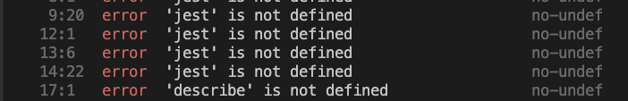

This was an easy fix previously. Under env - you had to set the jest to true.

```json
{
  "env": {
    "jest": true
  }
}
```



The fix in Eslint 9 is

```json
export default [
  {
    languageOptions: {
      globals: {
        ...globals.jest,
      },
    },
  },
```

Reference link - https://eslint.org/docs/latest/use/configure/language-options
